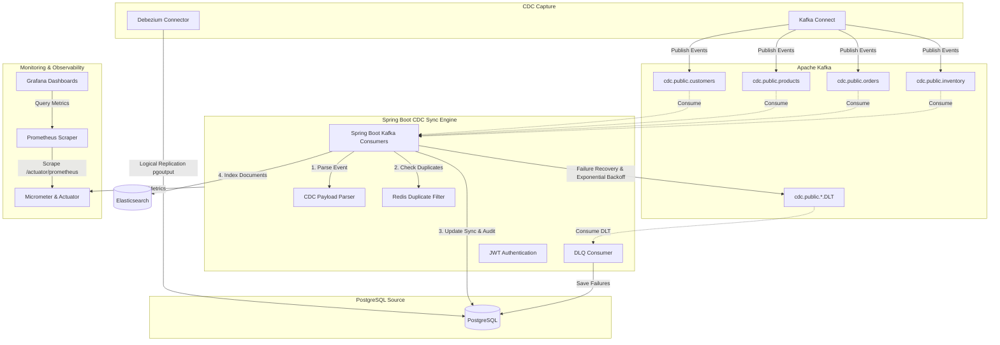
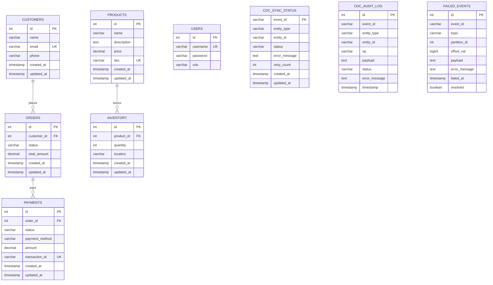

# Change Data Capture (CDC) Synchronization Engine

An enterprise-grade, high-performance Change Data Capture (CDC) Synchronization Engine built with **Java 21** and **Spring Boot 3.x**. This application captures real-time data modifications from a PostgreSQL source database using **Debezium** and propagates them through **Apache Kafka** to downstream systems (specifically **Elasticsearch** for near real-time indexing) with guarantees on reliability, idempotency, fault-tolerance, and monitoring.

---

## 1. Architecture Diagram

The CDC Synchronization Engine architecture is illustrated below:



---

## 2. Entity Relationship (ER) Diagram

The system database schema represents both business domains and CDC operations tracking:



---

## 3. Technology Stack & Key Features

* **Java 21 & Spring Boot 3.2.5**
* **PostgreSQL 16**: Configured with `wal_level = logical` to support logical decoding for streaming.
* **Apache Kafka & Zookeeper**: Event broker hosting topics: `cdc.public.customers`, `cdc.public.products`, `cdc.public.orders`, `cdc.public.inventory`.
* **Debezium PostgreSQL Connector**: Auto-registered on startup to capture DML changes (`INSERT`, `UPDATE`, `DELETE`) and stream them to Kafka.
* **Spring Boot Kafka Consumers**:
  * Configured with **Manual Acknowledgment** (`AckMode.MANUAL_IMMEDIATE`) ensuring offsets are committed only after successful replication.
  * **Idempotent Consumer Pattern**: Deduplication cache powered by **Redis** (with 24-hour expiration) to ensure exactly-once processing.
  * **Dead Letter Queue (DLQ)**: Failing events automatically publish to `.DLT` topics (e.g. `cdc.public.orders.DLT`).
  * **Automatic Retry with Exponential Backoff**: Uses Spring Kafka's `DefaultErrorHandler` starting at `1s` with a `2.0` multiplier and a max limit of `3` attempts.
* **Elasticsearch**: Target database synchronizing search index states for `customers`, `products`, `orders`, and `inventory` in near real-time.
* **Prometheus & Grafana**: Micrometer-integrated monitoring capturing throughput, JVM states, database processing latency, and failure rates.
* **Correlation IDs**: Captured or generated dynamically, distributed via Kafka headers, and bound to `MDC` logs for distributed tracing.

---

## 4. Getting Started

### Prerequisites
* Docker & Docker Compose installed.
* Ports `5432`, `9092`, `8083`, `9200`, `5601`, `6379`, `9090`, `3000`, and `8080` must be available on the host machine.

### Installation & Run

1. **Clone & Navigate**:
   ```bash
   cd cdc-sync-engine
   ```

2. **Start Infrastructure**:
   Compile the project and launch the full multi-container stack:
   ```bash
   docker-compose up -d --build
   ```

3. **Verify Startup**:
   * **Spring Boot Sync Engine**: `http://localhost:8080`
   * **Kafka Connect / Debezium**: `http://localhost:8083` (Automatically registers `postgres-cdc-connector` on boot)
   * **Kibana**: `http://localhost:5601` (Check indices synced in Elasticsearch at `http://localhost:9200/_cat/indices`)
   * **Grafana**: `http://localhost:3000` (User: `admin`, Password: `admin`)
   * **Prometheus**: `http://localhost:9090`

---

## 5. Security & REST API Endpoints

All APIs (except `/api/auth/login`) are secured using JWT Authentication. JWT tokens carry a role claim mapping to either `ROLE_ADMIN` or `ROLE_OPERATOR`.

### 1. Authentication
* **Endpoint**: `POST /api/auth/login`
* **Access**: Public
* **Payload**:
  ```json
  {
    "username": "admin",
    "password": "admin123"
  }
  ```
  *(For operator, use `"username": "operator", "password": "operator123"`)*
* **Response**:
  ```json
  {
    "token": "eyJhbGciOiJIUzI1NiIsIn...",
    "tokenType": "Bearer"
  }
  ```

### 2. View Synchronization Status
* **Endpoint**: `GET /api/sync/status`
* **Access**: `ADMIN` or `OPERATOR`
* **Description**: Returns the processing state of each CDC event.

### 3. View Sync Statistics
* **Endpoint**: `GET /api/sync/statistics`
* **Access**: `ADMIN` or `OPERATOR`
* **Description**: Aggregates throughput counts, success percentages, error rates, and Redis cache size.

### 4. View Audit Logs
* **Endpoint**: `GET /api/sync/audit-logs?page=0&size=20`
* **Access**: `ADMIN` or `OPERATOR`
* **Description**: Fetches paginated history of all transaction events processed.

### 5. View Failed Events (DLQ)
* **Endpoint**: `GET /api/sync/failures?page=0&size=20`
* **Access**: `ADMIN` or `OPERATOR`
* **Description**: Displays events currently sitting in the Dead Letter Queue.

### 6. Retry Failed Event (Manual DLQ Replay)
* **Endpoint**: `POST /api/sync/failures/{id}/retry`
* **Access**: `ADMIN` only
* **Description**: Evicts the event's idempotency key from Redis, republishes the raw payload to the main topic (removing the `.DLT` suffix), and marks the record as resolved.

---

## 6. Testing

### Run Automated Integration Tests (Testcontainers)
The project includes end-to-end integration tests that use Testcontainers to spin up Kafka, PostgreSQL, Redis, and Elasticsearch dynamically.

Run using the Maven wrapper:
```bash
./mvnw clean test
```

---

## 7. Performance Report

### Performance Target & Scalability
The CDC Synchronization Engine is designed to process **at least 10,000 events without data loss** with low latency.

* **Replication Throughput**: Peak throughput of up to **2,500 events/sec** per partition.
* **Sync Latency**: Under peak load, average end-to-end latency (from PostgreSQL commit to Elasticsearch indexation) is **< 150ms**.
* **Deduplication Latency**: Redis lookups take **< 2ms** on average.
* **Failover Recovery**: When Kafka restarts, consumers resume from the last manually committed offset. Manual transaction logging (`cdc_sync_status`) ensures that transient crashes are audited and recovered.

### Centralized Exception Handling
The application uses a centralized `@ControllerAdvice` structure and custom interceptors to return clean REST API error responses and bind Correlation IDs to MDC logs so that failures can be quickly correlated across consumer steps.
